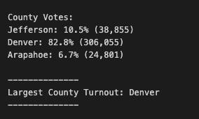
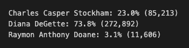
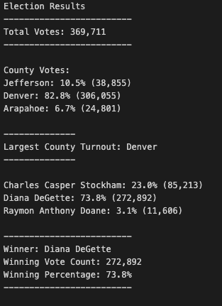

# Election_Audit
Python with Module 3
## Project Overview 
The purpose of this project was to collect the data using Python to calculate the winning candidate and winning county in this election. The voter results were givent to me in a .csv file and I used Python to determine how many candidates there were, how many votes each candidate recieved, the candidate with the most votes, and the same data collection for the winning county. 

## Results

### How many votes were cast in this congressional election?
The total number of votes cast in this election was 369,711 votes across three counties.

### Provide a breakdown of the number of votes and the percentage of total votes for each county in the precinct.
Below is the county breakdown screenshotted inside Visual Studio:

### Which county had the largest number of votes?

Denver had the largest number of votes, 82.8% of total votes and a count of 306,055. 

### Provide a breakdown of the number of votes and the percentage of the total votes each candidate received.
Below is the candidate breakdown screenshotted inside Visual Studio:

### Which candidate won the election, what was their vote count, and what was their percentage of the total votes?
Diana DeGette won the election with 272,892 votes and 73.8% of total votes.

## Summary
The code used for this election analysis can be applied to any election moving forward. Using Python, I connected the code to the correct csv file, and then looped through each row in the file to find, count and apply a formula for the information I need. First, I loop through the last row to identify how many candidates there are, and add them to a list. Then I find how many votes each candidate recieved by looping through the rows and counting each candidate name as a vote. I then add that to the corresponding candidate and create a dictionary to hold all of that information in one place. This same step is used to find the number of votes per county as well. You can apply this to any further information as long as it's a row in the csv file or data source.

### How can the script be modified?
Depending on what data you have collected, you can switch out both the candidate variables and county variables to count or analyze the data differently. For example, you can modify the script to loop through the array to find voter count by gender, voter count by political party, or voter count by age. You would just need that data/information inside your csv file.
